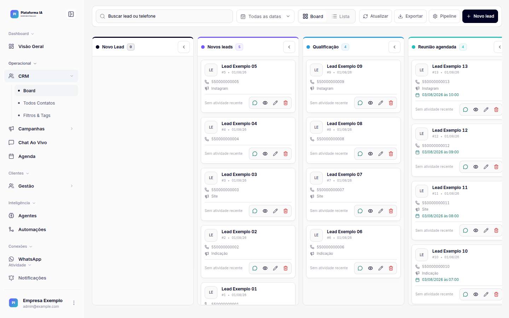
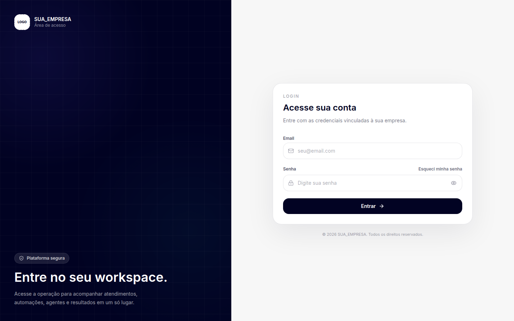

# Plataforma de agentes de IA

Projeto educacional full stack para criar e operar agentes de IA, CRM, fluxos, automações, campanhas e integrações de WhatsApp. A distribuição pública usa marca neutra: antes de publicar sua instalação, troque `SUA_EMPRESA` e os arquivos em `frontend/public/branding/` pela identidade da sua empresa.

## Visão da plataforma

As telas abaixo usam uma marca demonstrativa e dados totalmente fictícios.

### Dashboard


### CRM



### Login



## Stack

- Backend: Python 3.12, FastAPI, SQLAlchemy e Alembic.
- Banco: PostgreSQL 15 ou superior.
- Filas e eventos em tempo real: Redis e Celery.
- Frontend: React 18, TypeScript, Vite 7 e Tailwind CSS.
- WhatsApp: WAHA, opcional para quem habilitar os recursos de mensageria.

SQLite não é suportado para uma instalação completa. O modelo usa recursos próprios do PostgreSQL, como `JSONB` e `ARRAY`.

## Comece aqui

O roteiro público foi organizado para que a instalação parta de um banco vazio:

1. [Pré-requisitos](docs/public/01-pre-requisitos.md)
2. [Instalação local](docs/public/02-instalacao-local.md)
3. [Banco de dados e primeiro administrador](docs/public/03-banco-de-dados.md)
4. [Variáveis de ambiente e integrações](docs/public/04-configuracao.md)
5. [Nome, logo e identidade visual](docs/public/05-personalizacao.md)
6. [Deploy no servidor](docs/public/06-deploy.md)
7. [Solução de problemas](docs/public/07-troubleshooting.md)
8. [Checklist pós-clone](docs/public/08-checklist-pos-clone.md)

O [índice da documentação pública](docs/public/README.md) também explica a ordem recomendada.

## Inicialização rápida em desenvolvimento

Depois de instalar os pré-requisitos:

```bash
git clone https://github.com/matheusmontelro/plataforma-agentes-ia.git sua-plataforma
cd sua-plataforma

python3.12 -m venv .venv
source .venv/bin/activate
python -m pip install --upgrade pip
python -m pip install -r backend/requirements.txt

cp .env.development.example backend/.env
cp frontend/.env.development.example frontend/.env.local

npm --prefix frontend ci
```

Preencha os dois arquivos locais, crie o PostgreSQL e então execute:

```bash
cd backend
alembic upgrade head
cd ..

python -m backend.scripts.bootstrap_admin \
  --email admin@exemplo.com \
  --company-name "Sua Empresa" \
  --document 00000000000000
```

A senha do primeiro administrador é solicitada de forma oculta; não existe senha padrão. Troque o documento de exemplo pelo CPF ou CNPJ da empresa, usando somente dígitos.

A edição pública não oferece autocadastro. O primeiro acesso é criado pelo bootstrap e as demais contas ou workspaces são administrados por usuários autorizados dentro da plataforma.

Com PostgreSQL e Redis ativos, abra dois terminais:

```bash
# Terminal 1, na raiz do projeto e com o venv ativo
python -m uvicorn backend.main:app --env-file backend/.env --reload --host 127.0.0.1 --port 8002
```

```bash
# Terminal 2
npm --prefix frontend start
```

O frontend usa a porta configurada em `frontend/.env.local` e encaminha as rotas da API para o backend. Consulte a documentação antes de ativar workers, WAHA ou integrações externas.

## Segurança

- Nunca envie `.env`, chaves, tokens, bancos locais, mídias ou credenciais para o Git.
- Gere segredos exclusivos para cada instalação e ambiente.
- Use HTTPS em produção e mantenha banco, Redis e backend fora da internet pública.
- Rode `python tools/security_check.py` antes de publicar alterações.
- Leia [SECURITY.md](SECURITY.md) para comunicar vulnerabilidades.

## Contribuição

Correções e melhorias são bem-vindas. Leia [CONTRIBUTING.md](CONTRIBUTING.md) antes de abrir uma contribuição.

## Licença

Este projeto é distribuído sob a [licença MIT](LICENSE), inclusive para uso comercial.
